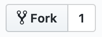

# Contribuciones

Todas las contribuciones se hará usando este repositorio.

## Formato para variables médicas

El principal objectivo de este proyecto es construir una base de datos con variables médicas para que puedan usarse para toma de decisiones y/o modelado. Algunas de estas variables (tasa de mortalidad, por ejemplo) pueden ser calculadas directamente de datos existentes, en otros casos, hay que revisar literatura y extraer los números de los artículos.

Cada una de las variables médicas estará alojada en un folder (ejemplo: `variables/mortalidad`), dentro de ese folder, seguiremos la siguient estructura.

* brief.md - Reporte en formato Markdown con la revisión de la literatura. El título del archivo debe ser el nombre de la variable, debe haber también un subsección con las fuentes citadas
* `src/` - Si se extraen archivos usando algún script, todo el código deberá estar en este folder. El código no debe asumir que ninguna conjunto de datos está presente, deberá descargarlos de internet y poder ejecutarse con un comando (ejemplo: `python analysis.py`)
* README.md - Archivo markdown con instrucciones generales para correr el código

## Cómo contribuir

1. Crea un fork de este repositorio dando click en el botón  en la esquina superior derecha
2. Esto creará una copia del repositorio en tu cuenta, se verá así: 

3. Edita los archivos a los que quieras contribuir, por ejemplo, 
4. 